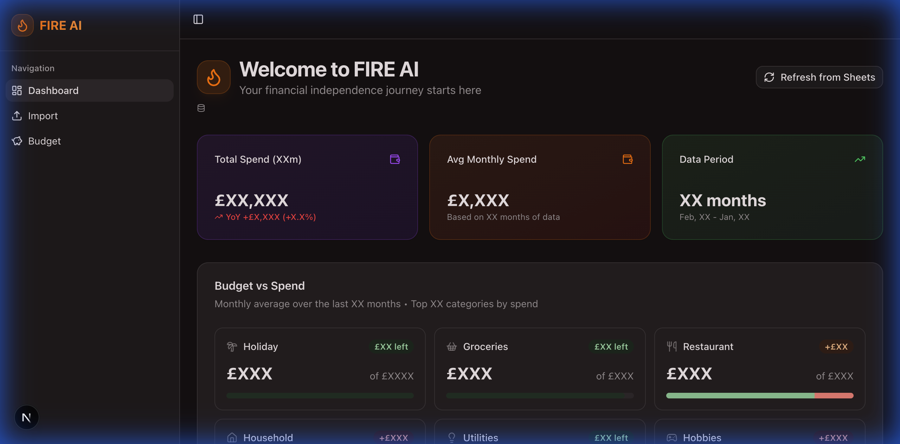

# 🔥 FIRE AI - Financial Tracker

A personal finance tracking application that categorizes transactions from CSV exports and syncs with Google Sheets. Features a premium web dashboard optimized with UX best practices, intelligent categorization, and a powerful CLI.



## ✨ Features

### Web App
- **Premium Dashboard**: Visualize monthly spending with interactive charts, YoY comparisons, and 12-month trends—now optimized with UX best practices for eye comfort.
- **Representative Icons**: Visual cues for every category for instant scanability.
- **Budget Management**: Set and track monthly budgets per category directly in the UI.
- **Local Caching**: Data cached in browser localStorage for instant load times (7-day expiry).
- **Smart Import**: Auto-date detection for next month's data.
- **Google Sheets Sync**: Two-way sync for transactions and budgets.

### CLI
- **Smart Categorization**: Auto-categorize transactions using custom rules
- **Auto-Date Detection**: Automatically determines the next month to process
- **Shadow Mode**: Preview changes in terminal without modifying sheets
- **Demo Mode**: Try instantly with sample data

## 🚀 Quick Start

### Prerequisites
- Python 3.9+
- Node.js 20+ (for web app)
- Google Cloud Project with Sheets API enabled

### Installation

```bash
# Clone and enter directory
git clone https://github.com/yourusername/fire-ai.git
cd fire-ai

# Setup Python environment
python3 -m venv .venv
source .venv/bin/activate
pip install -r requirements.txt

# Setup web app
cd web && npm install && cd ..
```

### Configuration

#### 1. Google Credentials
Place your service account JSON in `cli/resources/credentials.json`:
```bash
# This path is gitignored for security
```
**Important**: Share your Google Sheet with the service account email (Editor access).

#### 2. Sheet Config
```bash
cp cli/config/sheet_config.example.json cli/config/sheet_config.json
# Edit with your spreadsheet_id and sheet_name
```

#### 3. User Rules (Optional)
```bash
cp cli/config/user_rules.example.json cli/config/user_rules.json
# Customize category mappings and keywords
```

## 💻 Usage

### Start Everything (Recommended)
```bash
./start.sh
```
This starts both servers:
- **API**: http://localhost:8000
- **Web**: http://localhost:3000

Press `Ctrl+C` to stop both.

### CLI Only
```bash
# Demo mode with sample data
./run.sh

# Shadow mode (preview without updating sheet)
./run.sh --csv path/to/transactions.csv --shadow-mode

# Live update to Google Sheets
./run.sh --csv path/to/transactions.csv
```

## 🔒 Security

The following files contain sensitive data and are **gitignored**:
- `cli/resources/credentials.json` — Google service account key
- `cli/config/sheet_config.json` — Your spreadsheet ID
- `cli/config/user_rules.json` — Personal categorization rules
- `cli/csv/*.csv` — Transaction files (except sample.csv)

**Before committing**, verify sensitive files aren't tracked:
```bash
git ls-files | grep -E "(credentials|sheet_config.json|user_rules.json)"
# Should return empty
```

## 📁 Project Structure

```
fire-ai/
├── api/                 # FastAPI backend
│   └── server.py
├── cli/                 # Python CLI application
│   ├── config/          # Rules and sheet config
│   ├── csv/             # Transaction CSVs
│   ├── resources/       # Credentials (gitignored)
│   └── src/             # Core logic
├── web/                 # Next.js frontend
│   └── src/app/         # React pages
├── start.sh             # Start both servers
└── run.sh               # CLI runner
```

## 🧪 Testing

```bash
./test.sh
```

## License

MIT
